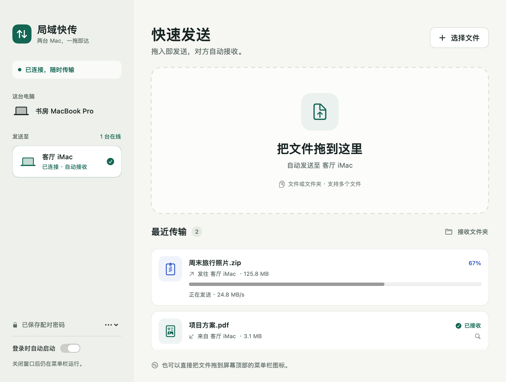
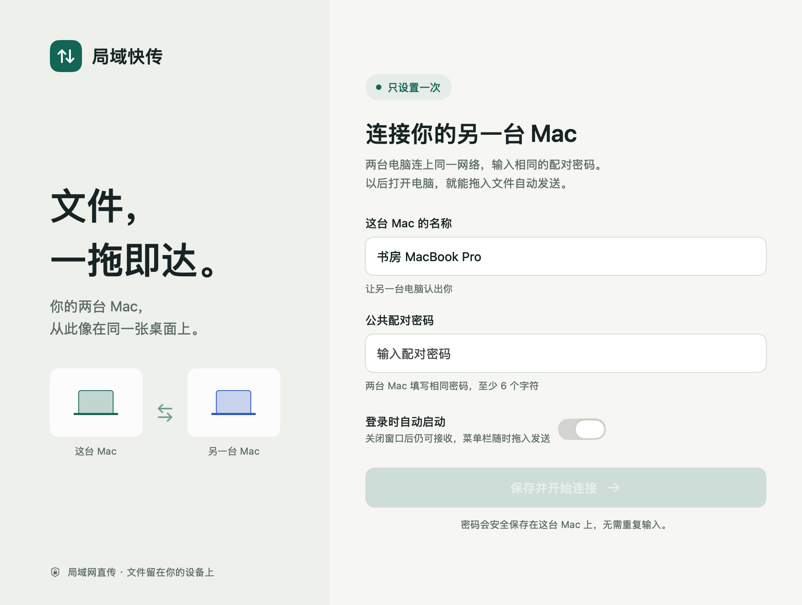

# 局域快传 · LanDrop

A native macOS app for encrypted LAN file sharing. Pair once with a shared password, then drag files into the window or menu bar to send. No cloud server or manual IP configuration.

原生 macOS 局域网文件传输应用。两台 Mac 各输入一次相同密码，之后自动发现、配对、重连和接收。把文件拖到窗口或菜单栏的双箭头图标，松手即可发送。

[下载最新版本](https://github.com/SikeFix/lan-drop/releases/latest) · [报告问题](https://github.com/SikeFix/lan-drop/issues) · [MIT 许可证](LICENSE)

支持 macOS 13 及以上版本，安装包同时支持 Apple 芯片和 Intel Mac。



*界面预览使用示例设备与传输数据。*

## 使用

1. 从 [Releases](https://github.com/SikeFix/lan-drop/releases/latest) 下载 ZIP，解压后将「局域快传.app」放入两台 Mac 的「应用程序」文件夹，连接同一个 Wi-Fi 或有线局域网。
2. 第一次打开，各输入设备名称和完全相同的配对密码，至少 6 个字符，建议使用较长的密码。
3. 若 macOS 询问局域网、下载文件夹或后台运行权限，首次允许。接收端无需点击确认。
4. 把文件拖入窗口，或直接拖到菜单栏双箭头图标。文件会自动保存到对方的 `~/Downloads/局域快传/`。

关闭窗口后，应用继续在菜单栏运行。启用登录时启动后，下次登录会自动运行；退出应用、Mac 休眠或路由器隔离设备时无法传输。离线拖入的文件会在本次应用运行期间排队，连接后自动发送。文件夹会自动打包为 ZIP，接收后保留 ZIP 文件。

相同密码的设备都属于同一配对组。只有两台 Mac 时自动选择对方；多台设备时可以在设备列表中选定接收端。更换配对组可以使用「重新配对」。

<details>
<summary>查看首次配对界面</summary>



</details>

## 构建

需要 macOS 和 Xcode Command Line Tools，运行环境最低 macOS 13。

```sh
git clone https://github.com/SikeFix/lan-drop.git
cd lan-drop
./scripts/build-app.sh
```

默认生成同时支持 Apple 芯片和 Intel 的通用应用及 ZIP 包。仅构建本机版本使用 `./scripts/build-app.sh --native`。开发运行使用 `swift run LanDrop`；登录启动、通知和系统权限请在打包后的 `.app` 中验证。

```sh
swift test
```

默认使用本地 ad hoc 签名。通过网络分发到另一台 Mac 时，macOS 可能要求首次在「系统设置 → 隐私与安全性」中允许打开。正式分发需要 Apple Developer ID 签名及公证；可通过 `LANDROP_SIGN_IDENTITY` 指定签名身份，构建脚本不会自动公证。

## 实现

- SwiftUI / AppKit 原生界面和菜单栏拖放。
- Network.framework Bonjour 自动发现，无需输入 IP，文件不经过互联网服务器。
- 配对密码保存在 macOS 钥匙串。PBKDF2、临时 Curve25519 密钥交换、HMAC 身份认证和 AES-GCM 会话加密。
- 分块流式传输，每块接收确认后继续，避免大文件一次载入内存。
- 完整大小和 SHA-256 校验通过后才显示接收完成。接收失败清理临时文件，同名文件自动编号，不覆盖已有文件。

当前不支持中断续传：发送中的连接断开时会报告失败，需要重新拖入；等待发送的队列仍会自动等待重连。队列和历史仅保留在本次应用运行期间。

## 验证与贡献

本机通过 23 项测试，包含真实 Bonjour 自动发现与重连、TCP 双向传输、离线排队、加密校验、同名文件和路径安全。当前仍需要不同 Mac 之间的实机联测。部分受限运行环境会跳过无局域网权限的 Bonjour 测试。

欢迎提交 Issue 和 Pull Request。修改传输或文件处理逻辑后，请运行 `swift test`；修改界面后，请运行 `./scripts/build-app.sh --native` 并检查实际拖放效果。GitHub Actions 会执行测试并构建通用应用。

本项目使用 [MIT 许可证](LICENSE)。
